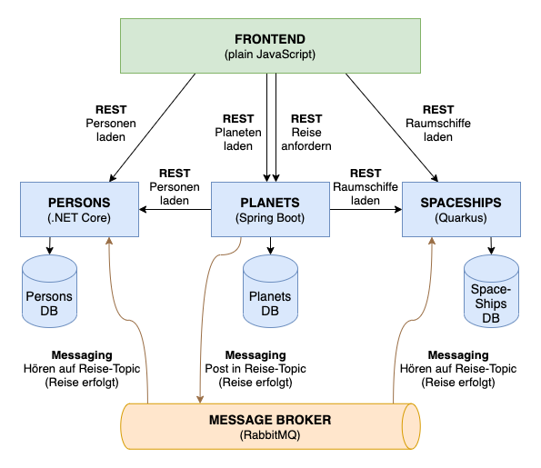

# PACT WARS - die Rebellion der API-Consumer

Das ist eine Demo-Anwendung für Consumer-Driven-Contract-Testing mit PACT.   
https://docs.pact.io/

Theorie und Informationen dazu sind hier zu finden:   
https://cofinpro.gitlab.io/Tech/konferenzen/pact-wars/

## Anwendung starten

Alle Docker-Container starten mit docker-compose:
```
docker-compose up -d
```

Die Anwendung läuft unter <http://localhost:8000>

## Was macht die Anwendung:

Die simple Aufgabe der Anwendung ist intergalaktische Reisen zu organisieren. 
Dazu gibt es drei Entitäten:
* **Planet** = ein Planet dient als Startpunkt einer Reise, ein anderer Planet als Ziel
* **Person** = eine Person befindet sich auf einem Planet und möchte reisen
* **Spaceship** = ein Raumschiff befindet sich auf einem Planet und kann für Reisen verwendet werden

Der User muss also einfach:
1. ein Start-Planet auswählen
2. eine Person auswählen, die auf diesem Planet ist
3. ein Raumschiff auswählen, das auf diesem Planet ist
4. ein Ziel-Planet auswählen und die Reise starten

Die Position der Personen/Raumschiffe wird dann aktualisiert nach der Reise.

## Architektur der Anwendung:

Da es hier um Schnittstellen-Tests geht, wurde die Architektur so definiert dass es viele Schnittstellen gibt.
Zusätzlich wurden verschiedene Technologien/Frameworks ausgewählt, die häufig heutzutage für Microservices verwendet werden.

| **Komponente** | **Framework**    | **Beschreibung** |
| -------------- | ---------------- | ---------------- |
| **Frontend**                                       |||
| frontend       | Plain JavaScript | Kommuniziert mit den Services per REST (Consumer) |
| **Backend**                                        |||
| persons        | .NET Core        | Bietet Personen-Schnittstelle an (Provider), bekommt Reise-Ergebnisse per Messaging um Positionen von Personen zu aktualisieren (Consumer) | 
| spaceships     | Quarkus          | Bietet Raumschiffe-Schnittstelle an (Provider), bekommt Reise-Ergebnisse per Messaging um Positionen von Raumschiffen zu aktualisieren (Consumer) | 
| planets        | Spring Boot      | Bietet Planeten- und Reise-Schnittstellen an (Provider), ruft Personen- und Raumschiffen-Positionen per REST auf (Consumer), erzeugt Messaging-Nachricht nach einer Reise (Provider) |
| **Infrastruktur**                                  |||
| postgres       | PostgreSQL       | Datenbank-Server für die Persistenz der Services UND vom Pact-Broker |
| rabbitmq       | RabbitMQ         | Message-Broker für asynchrone Messages |
| pactbroker     | PACT             | Broker Tool für Pacts (Contracts) |



## URLs:

| **Komponente**              | **URL** | Credentials |
| --------------------------- | ------- | ----------- |
| Anwendung (frontend)        | http://localhost:8000 |  |
| RabbitMQ Management Console | http://localhost:15672/#/ | User: guest, Pass: guest |
| Pact Broker                 | http://localhost:8005 |  |
| Persons-Service (REST)      | http://localhost:8001 |  |
| Planets-Service (REST)      | http://localhost:8002 |  |
| Spaceships-Service (REST)   | http://localhost:8003 |  |

## Offene TODOs:
* Pact-Tests für Messaging einbauen (bisher nur REST)

## Hilfreiche Befehle für Entwicklung/Ausprobieren

Rebuild a specific container with docker:   
`docker-compose up -d --force-recreate --no-deps --build service_name`

